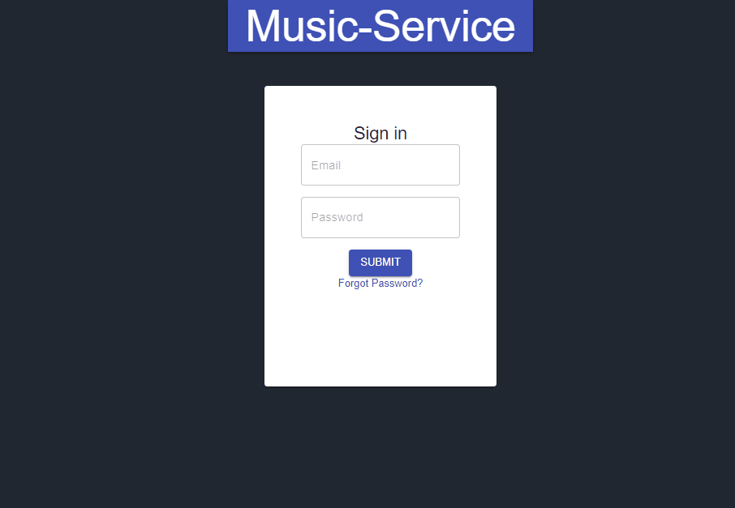
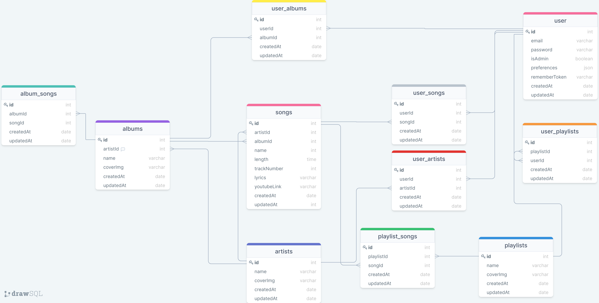
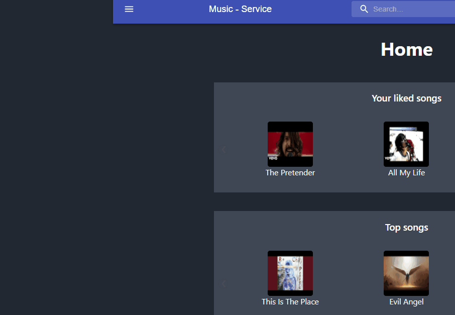
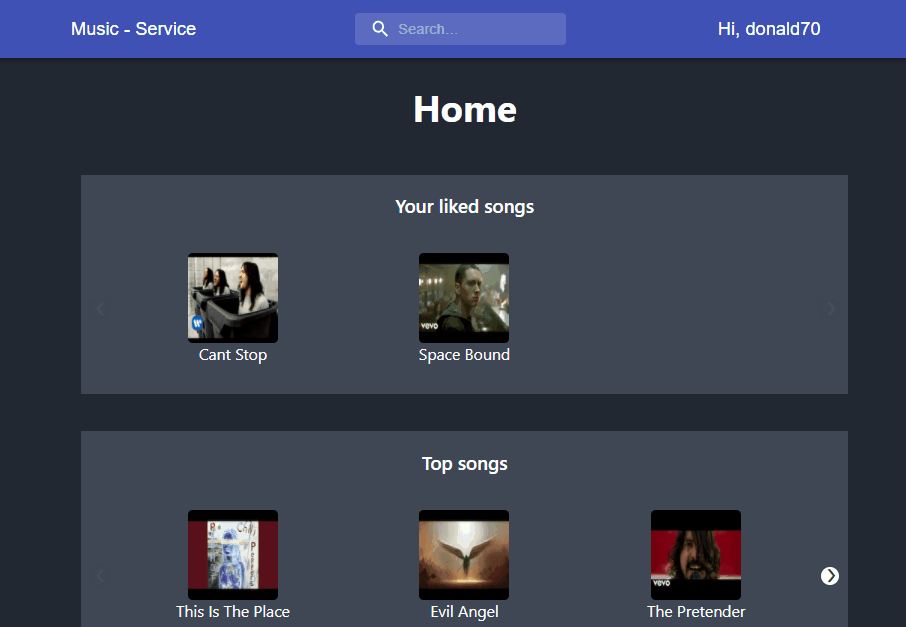
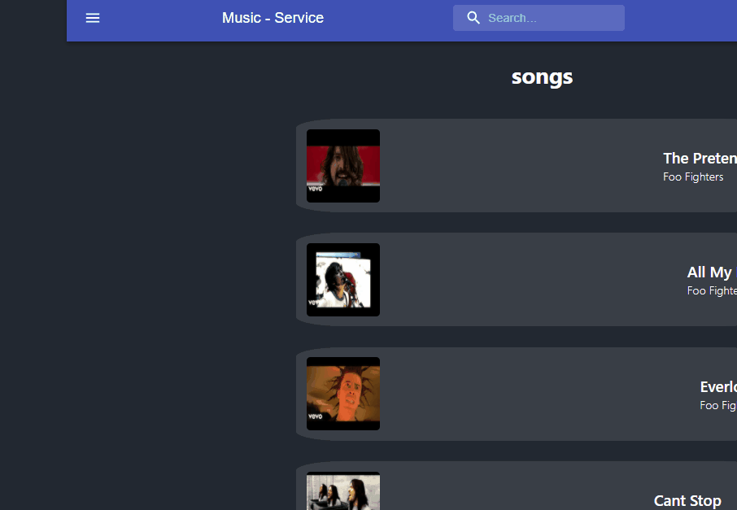

#    Zilbers - Music Service
In this project I created a Music Service Web Application, with React.js, Express and a MySql database. \
The search mechanism uses Elasticsearch database and the data is saved in their cloud service. \
The app is dockerized and can be run with the docker-compose. \
The app has a login page, customized home page per user, and page for each song / album / playlist. \
It also have backend which connects between the database and the client. \

## Database
- The app is using MySql database.
- It has 10 tables which holds that about the users registerd, songs, playlists and albums.
- The table is mostly using procedures for communiction.

## Backend
- The Express app located in the path `server/app.js` and exports the `app` object (`module.exports = app;`).
- The server runs on port `3001` serve the react app on `http://localhost:8080/` and exposes those API endpoints:
  - [GET] api/[:type] Can get data about all of the items of a certain type.
  - [GET] api/[:type]/[:id] Can get data about a certain item.
  - [GET] api/liked/[:type]/user[:id] Can get data about a liked items of the user.
  - [GET] api/search/ Can search for data from the songs table by filtering the the table with the search input.
  - [GET] api/[:type]/:id/list Can get all of the included songs in a certain ablum / playlist.
  - [GET] api/top/[:type] Can get top liked items from a certain category.
  - [POST] api/[:type] Can post data about a new item.
  - [POST] api/[:type]/like Can like an item and save it on server.
  - [PUT]  api/[:type]/[:id] Can update entries.
  - [DELETE] api/[:type]/[:id] Can delete entrie from the database.

## Client
- The app title is `Music Service`.
- The app loads (from the backend) and shows all of the songs, playlists and albums that are saved in the data base.
- The app has a menu to navigate.
- The app has input field. This input requests the server on `onChange` with relevant `searchText` param and shows songs that fits with the search text.

- The app has many different pages with data on every song, album and artist.
- Every song has `favorite` button which updates the server and saves it as liked by the logged in user.

